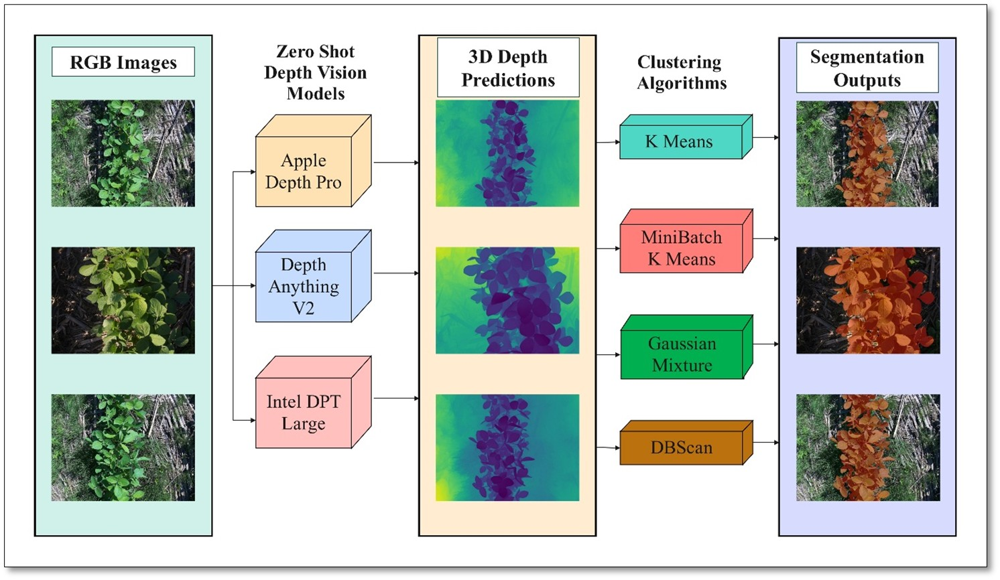
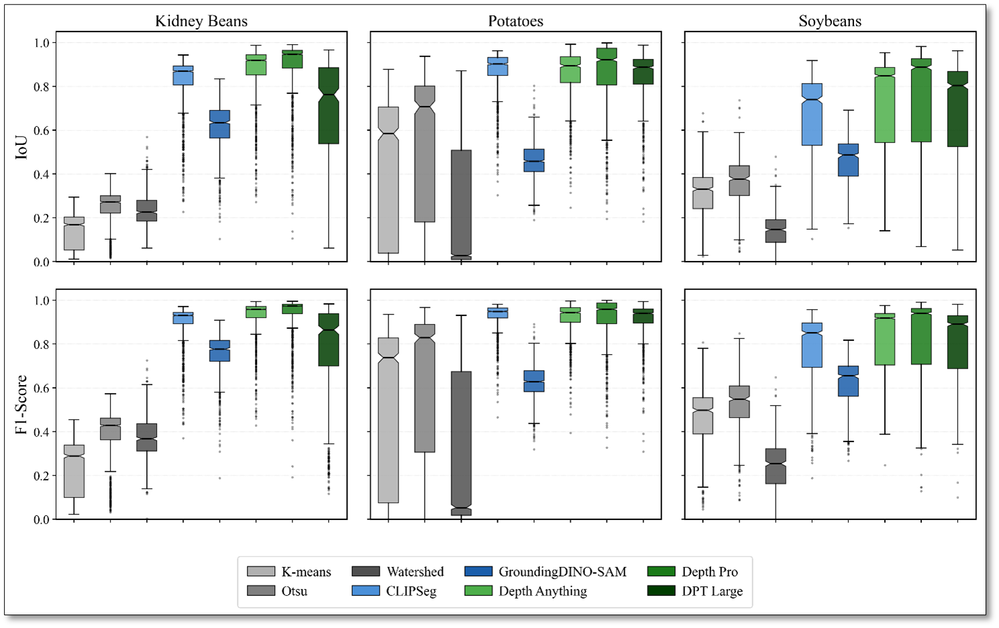
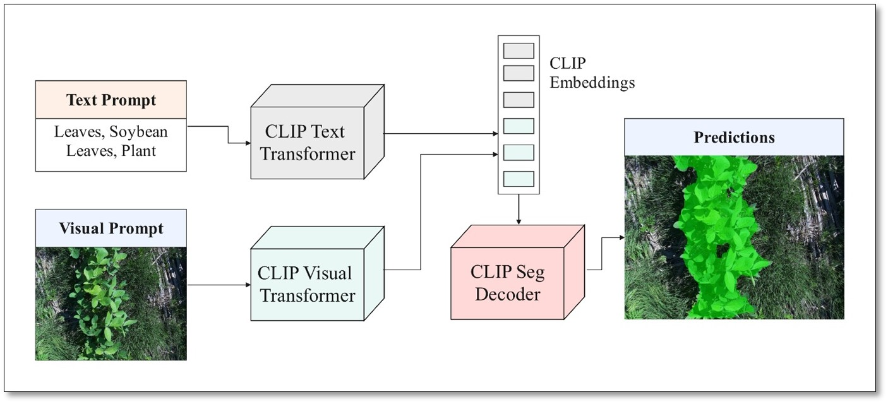

# Zero-Shot Crop Segmentation via 3D Depth-Aware Vision Pipeline

**Paper**: *Zero-Shot Crop Segmentation via 3D Depth-Aware Vision Pipeline using Unsupervised Clustering*

**Authors**: Hassan Afzaal, Aitazaz A. Farooque*, Gurjit S. Randhawa, Arnold W. Schumann, Nicholas Krouglicof, Yuvraj S. Gill, Qamar U. Zaman



**Affiliations**: University of Prince Edward Island | University of Guelph | University of Florida | Dalhousie University

---

## Overview

This repository contains a unified segmentation benchmark and inference framework for crop/soil separation using three method families:

- **Depth vision pipeline** (monocular depth + unsupervised clustering)
- **Zero-shot vision-language segmentation** (CLIPSeg and GroundingDINO+SAM)
- **Classical segmentation baselines** (Otsu, K-means, Watershed)

All pipelines now use shared evaluation utilities and a consistent output format:

- `results.csv`
- `visuals/<dataset>/<image>.png`
- `prediction_maps/<dataset>/<image>.npy` and `.png`

---

## Key Results



Benchmarks in this repository compare:

- **Depth vision models**: Depth Anything V2, Depth Pro, DPT-Large
- **Zero-shot models**: CLIPSeg, GroundingDINO+SAM
- **Classical segmentation**: Otsu, K-means, Watershed

Reported performance trends (from the paper and repository experiments):

| Method Family | Representative Method | F1-Score | IoU | Notes |
|---|---|---|---|---|
| **Depth Vision (Ours)** | Depth Anything + clustering | **0.875** | **0.803** | Best overall segmentation quality |
| Zero-Shot VLM | CLIPSeg / GroundingDINO+SAM | 0.767 | 0.647 | Strong annotation-free baseline |
| Classical Baselines | Otsu / Watershed / K-means | 0.406 | 0.290 | Fast but less robust |

---

## Study Area and Dataset

- **19,940 field images** captured by AgriScout autonomous robots across crop regions in Canada
- **2,409 ground-truth masks** manually annotated via Roboflow
- Crop types include Soybeans, Kidney Beans, and Potatoes

---

## Repository Structure

```text
├── depth_models/
│   └── pipeline.py                # Unified depth pipeline (runs all depth models by default)
│
├── zero_shot/
│   └── pipeline.py                # Unified zero-shot pipeline (runs all zero-shot models by default)
│
├── classical_segmentation/
│   └── classical_segmentation.py  # Classical baselines
│
├── clustering/
│   └── clustering_comparison.py   # Clustering comparison on saved depth maps
│
├── Images/
│   ├── 1.jpg
│   ├── 2.jpg
│   └── 3.png
│
├── sample_data/
│   └── sample_data/
│       ├── RGB/
│       └── Ground Truth/
│
├── eval_utils.py
├── requirements.txt
└── README.md
```

---

## Zero-Shot Model



The unified zero-shot pipeline supports both model variants through one entry point:

- `clipseg`
- `groundingdino_sam`

By default, both are run sequentially and stored under `outputs/all_methods/zero_shot/`.

---

## Installation

```bash
git clone https://github.com/<your-username>/3D-Depth-Vision-Based-Crop-Segmentation.git
cd 3D-Depth-Vision-Based-Crop-Segmentation
pip install -r requirements.txt
```

A CUDA-capable GPU is recommended. CPU execution is supported.

For GroundingDINO + SAM, ensure SAM dependencies are available:

```bash
pip install segment-anything@git+https://github.com/facebookresearch/segment-anything.git
```

---

## Usage

### Depth Vision Pipeline (Unified)

```bash
# Run all depth models (default)
python depth_models/pipeline.py --data-root sample_data

# Run only one model
python depth_models/pipeline.py --model depth_anything --data-root sample_data
python depth_models/pipeline.py --model depth_pro --data-root sample_data
python depth_models/pipeline.py --model dpt_large --data-root sample_data
```

### Zero-Shot Pipeline (Unified)

```bash
# Run all zero-shot models (default)
python zero_shot/pipeline.py --data-root sample_data

# Run only one model
python zero_shot/pipeline.py --model clipseg --data-root sample_data --folder sample_data
python zero_shot/pipeline.py --model groundingdino_sam --data-root sample_data --folder sample_data
```

### Classical Segmentation

```bash
python classical_segmentation/classical_segmentation.py --data-root sample_data
```

### Clustering Comparison

```bash
python clustering/clustering_comparison.py
```

---

## Data Layout

Expected dataset layout:

```text
<data_root>/
    <dataset_folder>/
        RGB/
        Ground Truth/
```

For this repository snapshot, sample data is available as:

```text
sample_data/sample_data/RGB
sample_data/sample_data/Ground Truth
```

---

## Unified Output Layout

All methods save into one root:

```text
outputs/all_methods/
```

Each pipeline writes:

- `results.csv`
- `visuals/...`
- `prediction_maps/...`

Depth pipeline also writes raw depth maps used by clustering:

- `outputs/all_methods/depth_models/<model>/depth_maps/...`

---

## Evaluation Metrics

Shared metrics across all methods:

- IoU
- F1-Score
- Precision
- Recall
- Pixel Accuracy
- Inference time per image (where applicable)

---

## Acknowledgments

This research was supported by the Natural Sciences and Engineering Research Council of Canada (NSERC) through the Canada Graduate Scholarship and the NSERC Alliance Sustainable Agriculture Initiative Program.

## License

Please contact the corresponding author (afarooque@upei.ca) for data access and licensing inquiries.
